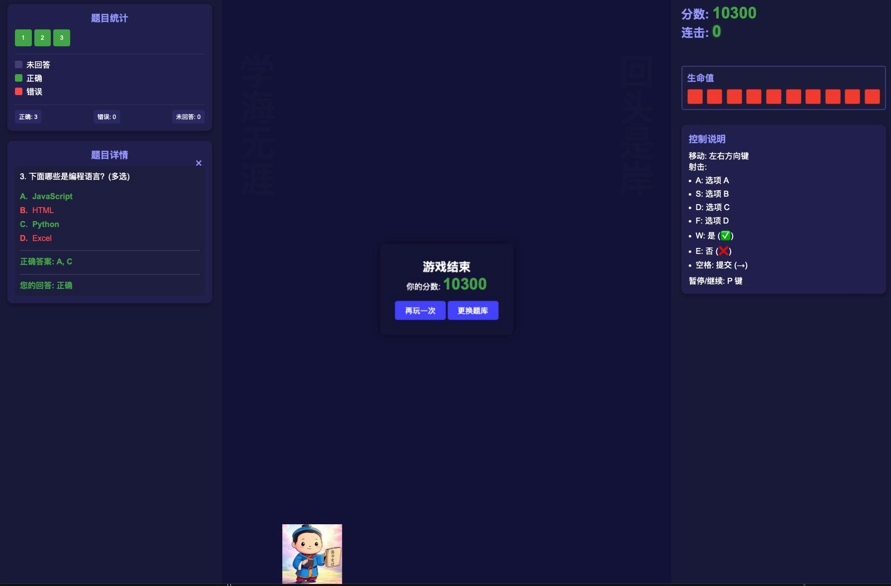

# 太空问答射击游戏 (Space Quiz Shooter)

一款结合问答与射击的学习型游戏，边玩边学习知识点。


## 游戏玩法

1. 选择题库和难度后开始游戏
2. 使用左右方向键移动飞船
3. 使用以下按键发射不同类型的子弹回答问题：
   - `A`: 选项 A
   - `S`: 选项 B
   - `D`: 选项 C
   - `F`: 选项 D
   - `W`: 是 (✓)
   - `E`: 否 (✗)
   - `空格`: 提交 (→) (用于多选题)
4. 游戏结束后可以点击左侧题目编号复习题目



## 游戏规则

- 题目会出现在敌人上方
- 每个敌人都对应一道题目
- 射击正确答案的子弹击中敌人可将其消灭
- 若射击错误答案，敌人会获得一个护盾
- 当敌人获得3个护盾后，你将获得5秒无敌时间
- 如果敌人到达屏幕底部，你将失去一个生命点（除非处于无敌状态）
- 当你失去所有10个生命点时，游戏结束
- 连续答对题目可获得连击加成，提高分数

## 特色功能

- 支持导入自定义题库
- 多种题型：单选题、多选题和是非题
- 分数追踪与统计
- 生命值显示
- 无敌状态加成
- 三种游戏难度可选
- 游戏结束后可复习所有题目

## 技术实现

本游戏使用原生HTML、CSS和JavaScript构建，无需任何外部库。

### 项目结构

```
game/
├── assets/        # 游戏图像资源
├── css/           # 样式文件
│   ├── style.css
│   └── question-styles.css
├── js/            # 游戏逻辑
│   ├── game.js
│   └── question-manager.js
├── question-banks/ # 题库文件夹
└── index.html     # 主游戏页面
```

## 免责声明

本项目仅供学习和教育目的使用，不得用于商业用途。所有题库内容的版权归原作者所有。

## 标签

学习游戏, 问答游戏, 射击游戏, 教育工具, 知识测验, 太空游戏, HTML5游戏, JavaScript游戏, 自定义题库, 闯关游戏 