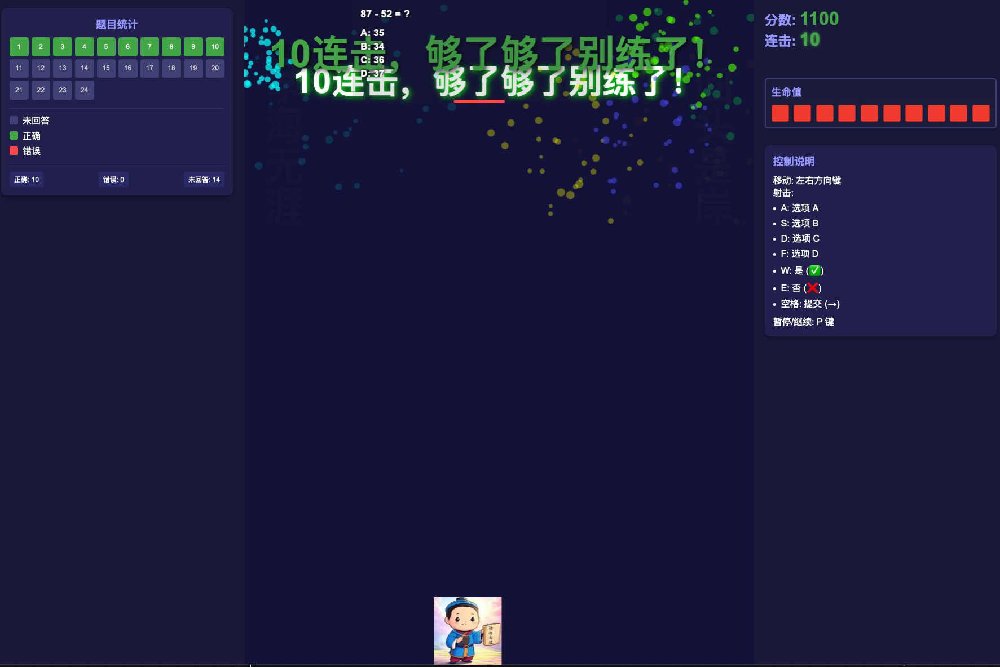
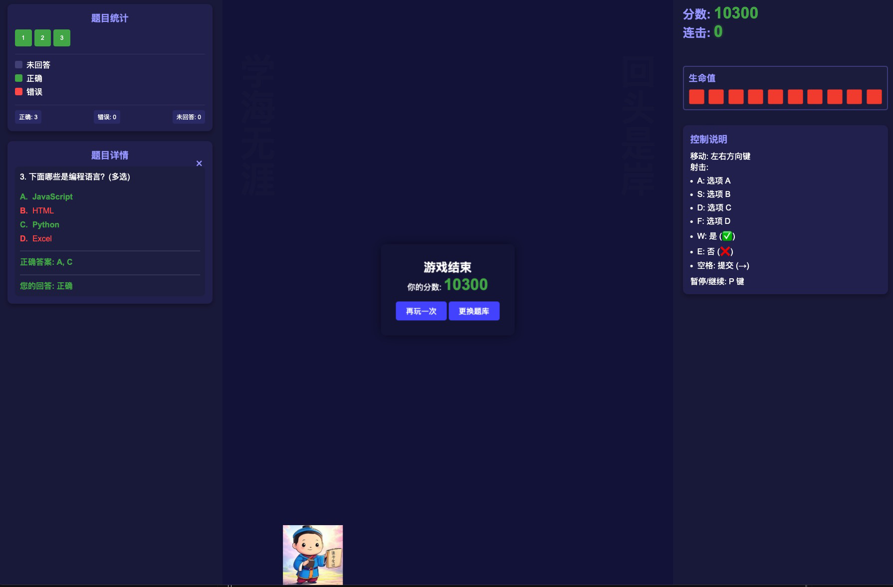

# Space Quiz Shooter

A learning-based game that combines quiz questions with shooting gameplay, allowing you to learn while playing.

[中文版](README.md)



## How to Play

1. Select a question bank and difficulty level to start the game
2. Use the left and right arrow keys to move your spaceship
3. Use the following keys to shoot different types of bullets to answer questions:
   - `A`: Option A
   - `S`: Option B
   - `D`: Option C
   - `F`: Option D
   - `W`: True (✓)
   - `E`: False (✗)
   - `Space`: Submit (→) (for multi-select questions)
4. After the game ends, you can click on question numbers in the left panel to review questions



## Game Rules

- Questions appear above enemies
- Each enemy corresponds to one question
- Shooting the correct answer bullet at an enemy destroys it
- If you shoot the wrong answer, the enemy gains a shield
- When an enemy gets 3 shields, you become invincible for 5 seconds
- If an enemy reaches the bottom of the screen, you lose one health point (unless invincible)
- The game ends when you lose all 10 health points
- Consecutive correct answers give you combo bonuses to increase your score

## Features

- Support for custom question banks
- Multiple question types: single-choice, multi-choice, and true/false
- Score tracking and statistics
- Health display
- Invincibility power-up
- Three difficulty levels to choose from
- Question review after game completion

## Technical Implementation

This game is built using vanilla HTML, CSS, and JavaScript without any external libraries.

### Project Structure

```
game/
├── assets/        # Game images
├── css/           # Style files
│   ├── style.css
│   └── question-styles.css
├── js/            # Game logic
│   ├── game.js
│   └── question-manager.js
├── question-banks/ # Question bank folder
└── index.html     # Main game page
```

## Disclaimer

This project is for learning and educational purposes only and may not be used for commercial purposes. All question bank content copyrights belong to their original authors.

## Tags

Learning Game, Quiz Game, Shooting Game, Educational Tool, Knowledge Quiz, Space Game, HTML5 Game, JavaScript Game, Custom Question Banks, Level-based Game 